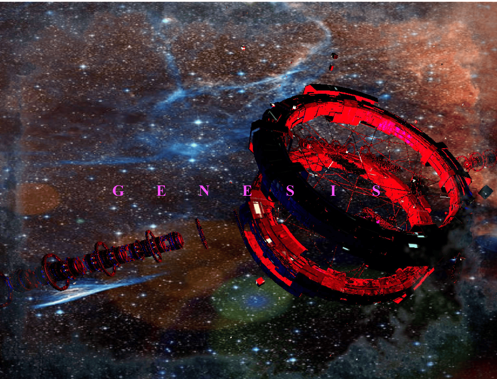

### Hey, I'm Jackson Uptain

  

</img>
🇺🇦
<head>
  <link rel="icon" href="logo-removebg-preview (1).png" type="image/gif">
</head>

<strong>Currently:  I've taken a small break on GitHub to dive deeper into 3d game development...I have invited some friends to join me and it's been fun! I went to the basics of rendering 3d in java and OpenGL.. Currently we are working on a game, and according to my friends, were going to put it up for sale. </strong>

🇺🇦

<strong>Hey, I'm Jackson Uptain, I live in Alabama, I'm 14 years old and for the last 11 months I've been working on code projects. I learned how to code at Codecademy.com and I've enjoyed every minute of it. My current skills are in: JavaScript, Java, HTML5, CSS, and system OS like the Raspberry PI. I also love experimenting with A-Frame web VR and Three.JS. If your interested in collaborating with me then just invite me to your Organization. This is a very active and experimental account, so feel free to check in every once in a while</strong>

🇺🇦
 

 

<strong>A Sample of My Upcoming Website:</strong> https://jacksonuptain.github.io/Parallax-Effect-FullCode-From-TrueCoderYT/3D-Parallax-Website-in-JavaScript-main/index.html

https://github.com/JacksonUptain/JacksonUptain/assets/111402072/18b832cf-6375-44ed-8cf0-ba571d8eb535

 
<strong>Fact of the day: Search up your name and check the repos in github...for me, I found an appreciation page: https://github.com/puntorigen/be_grateful</strong>
